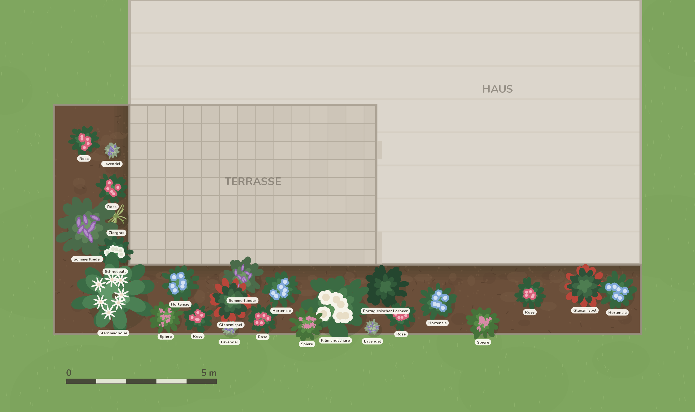
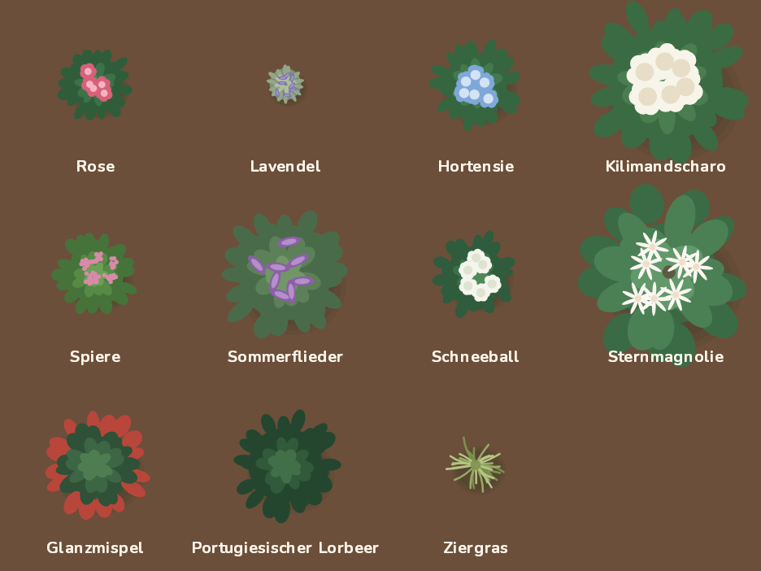

# Merkbeet

Eine kleine App für ein einzelnes Blumenbeet: der Garten meiner Eltern von
oben, mit jeder Pflanze an ihrer echten Stelle. Der Zweck ist, sich zu merken,
wo etwas steht — besonders bei frisch Gepflanztem, das man noch nicht sieht.

Bewusst keine allgemeine Gartenplanungs-App: die Geometrie ist genau dieser
eine Garten.



## Was drin ist

- Maßstabsgetreuer Plan von oben: Haus, Terrasse, L-förmiges Beet, Rasen
- 25 Pflanzen aus der Handskizze, an ihren gemessenen Positionen
- Verschieben, Pinch-Zoom, Panning über die ganze Länge von 19,50 m
- Antippen öffnet die Pflanzenkarte: Name, Foto, Notizen, Pflanzdatum, Größe
- Etiketten lassen sich ausblenden; beim Herauszoomen verschwinden sie von selbst
- Bearbeiten-Modus: erst darin lässt sich etwas verschieben, ändern, hinzufügen
  oder entfernen — im Alltag kann also nichts verrutschen
- Gemeinsamer Stand auf allen Geräten, offline weiterarbeiten inklusive —
  siehe [docs/sync.md](docs/sync.md)

## Loslegen

```bash
pnpm install
pnpm run android     # oder: pnpm run ios
```

Skia ist kein Teil von Expo Go, deshalb braucht die App einen Dev-Client oder
einen echten Build. Für Android gibt es eine fertige APK — wie sie gebaut wird,
steht in [docs/android.md](docs/android.md).

Die Web-Variante läuft ebenfalls vollständig — Skia kommt dort als CanvasKit
(WebAssembly) und braucht WebGL, das jeder aktuelle Handy-Browser hat.

## Wo es läuft

**<https://merkbeet.schnau.dev>** — öffentlich erreichbar, weil die Geräte
meiner Eltern nicht im Tailnet sind. Geschützt durch einen gemeinsamen
Zugangscode; der Code steht in `secrets/secrets.yaml` in `~/infra` unter
`projects/merkbeet/passcode`.

Der Dienst ist als `projects.merkbeet` in `~/infra` deklariert. Ein Deployment
holt den Stand von `main` aus der Gitea:

```bash
pnpm run typecheck && pnpm run test   # vorher
jj-push main                          # dann
cd ~/infra && nix flake lock --update-input merkbeet && just deploy-host srv-2
```

Lokal:

```bash
pnpm install
pnpm run setup:web    # legt canvaskit.wasm in public/ ab (nicht im Repo)
pnpm run web          # Dev-Server
pnpm run server       # Sync-Dienst, braucht MERKBEET_PASSCODE
pnpm run deploy:preview   # Vorschau ins Tailnet, gegen den echten Dienst
```

```bash
pnpm run typecheck   # tsc --noEmit
pnpm run test        # Merge-Konvergenz und Sync-Dienst über HTTP
pnpm run preview     # rendert docs/preview/*.png ohne Gerät oder Emulator
```

`pnpm run preview` ruft denselben Zeichencode wie die App auf, nur mit CanvasKit
in Node statt React Native. Das ist der schnellste Weg, an der Grafik zu
arbeiten: einmal laufen lassen, PNG anschauen.

## Aufbau

```
src/garden/     Datenmodell und der Garten selbst (plan.ts, species.ts)
src/state/      Zustand, lokale Persistenz, Sync-Zyklus
src/sync/       Sync-Datenmodell und Zusammenführen (rein, mit Tests)
src/view/       Skia-Rendering, Viewport, Gesten
src/ui/         Bildschirme und Bedienelemente
server/         Sync-Dienst: Bun, SQLite, liefert den Web-Client mit aus
scripts/        Ableitung der Skizzendaten, Vorschau-Renderer
docs/           Gartenmodell, Sync, Referenzskizze, Vorschaubilder
```

Drei Entscheidungen, die den Rest erklären:

**Koordinaten sind Meter.** Der Viewport rechnet in Pixel pro Meter um. Damit
sind Beetgeometrie und Pflanzenpositionen unabhängig von der Bildschirmgröße,
und Größenangaben in der Pflanzenkarte stimmen mit dem Bild überein.

**Pflanzen werden gezeichnet, nicht geladen.** Jede Art ist eine typisierte
Beschreibung aus Form, Blütenart und Farbpalette (`src/garden/species.ts`);
`src/view/plantArt.ts` macht daraus ein Skia-Picture. Kein Asset-Pipeline, bei
jedem Zoom scharf, und der Stil ist über den ganzen Garten automatisch
einheitlich. Der Zufall pro Pflanze ist aus ihrer id abgeleitet, damit dieselbe
Pflanze immer gleich aussieht.

Sobald es gezeichnete Bilder gibt, wird pro Art nur der `art`-Eintrag von
`{ kind: "procedural", … }` auf `{ kind: "asset", source: require("…png") }`
umgestellt. Renderer und Daten bleiben unverändert.

**Synchronisiert wird die Abweichung, nicht der Garten.** Über die Leitung geht
nur, was Menschen geändert haben — je Feld mit einem Zeitstempel vom Server.
Damit bleiben Korrekturen an `plan.ts` überall wirksam, und zwei Leute können am
selben Strauch arbeiten, ohne sich zu überschreiben.



## Wie die Skizze zu Daten wurde

Siehe [docs/garden-model.md](docs/garden-model.md) — dort steht, welche Maße
gemessen und welche geschätzt sind, und was noch bei den Eltern nachzufragen
ist.
